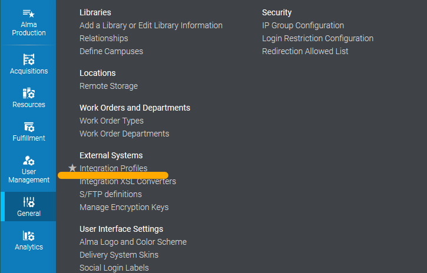
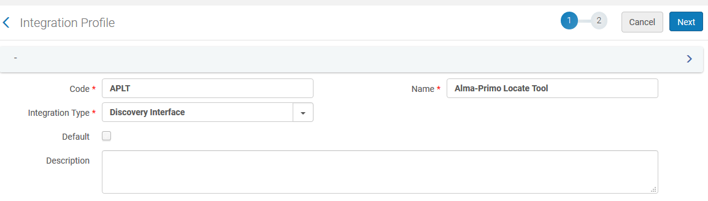
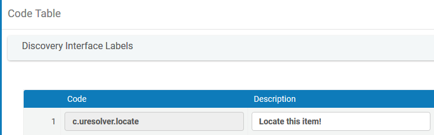
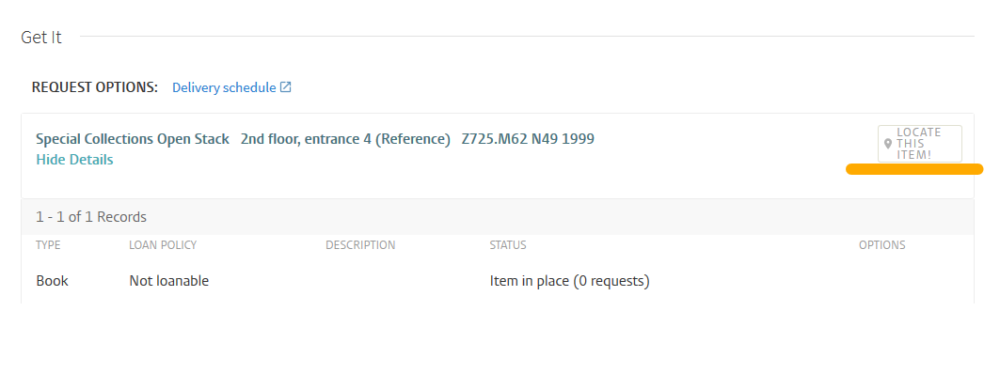

# Local and server installation

Installing APLT is easy. In this guide we will explain how to install the application locally on your machine, and on your server. Note that there are multiple ways of running an applicaiton made using Laravel. The ways described here are meant for users whom are interested simply at giving a look at the application.[^1]

## Local installation

**In your `.env` file, make sure `APP_ENV=local` and `APP_DEBUG=true` are set. This will help you with local development.**

Assuming you have [Composer](https://getcomposer.org/) and PHP installed locally on your machine:

1. Clone the repository from GitHub.  
2. `composer install` to install the required dependencies.  
3. `cp .env.example .env` to generate a .env file.  
4. `php artisan key:generate` to generate an encryption key.
5. Add your Alma API key in the `.env` file .

Your application is now ready to run, but has no database attached to it yet.  

Please take the time to familiarize with the .env file. The variables in this file are crucicial for your application to work properly.

### Local Database

!!! Note
    Laravel can use several different database connections: if you would like something else than MySQL or SQLite, please refer to the official [Laravel documentation](https://laravel.com/docs/7.x/database) for more information.

#### Local SQLite

If you are only testing the application, we advise using SQLite:

1. In your `.env` file, replace `DB_CONNECTION=mysql` with `DB_CONNECTION=sqlite`
2. Comment out, or delete, the additional `DB_` variables. These are not needed with SQLite.
3. In the `/database` folder, create a text file called `database.sqlite`.  
4. `php artisan migrate:fresh --seed` to populate the database, and create dummy data and an admin user.  
5. `php artisan serve` to lunch your application.  

#### Local MySQL

For production environments, or for extended development, we recommend using MySQL as your database.

1. In your .env file, make sure `DB_CONNECTION=mysql` is set.  
2. Generate a MySQL database, and make sure that the `.env` settings are properly set and that you can make a connection. The way you can generate a MySQL database locally can vary. We advise using [XAMPP](https://www.apachefriends.org/index.html).
3. With a MySQL database generated and connected to the app, use `php artisan migrate:fresh --seed` to populate the database, and create dummy data and an admin user.  
4. `php artisan serve` to lunch your application.  

!!! warning
    Do not use `php artisan migrate:fresh --seed` in a production environment as **it creates an admin user with a very weak password** and replaces all your currently entered data with samples!

## Server installation

!!! Danger
    **In your `.env` file, make sure `APP_ENV=staging` or `APP_ENV=production` and `APP_DEBUG=false` are set.** Do not publish a laravel application on a server without these settings or the application will output sensitive information about your server.

### FTP-only workaround

You can install this application on your server in multiple ways. While **we strongly recommend an SSH connection to your server**, you can also install this application using FTP only.

To work only via FTP, install the application locally on your machine following the steps above using a SQLite database. Run all the Artisan commands locally and then upload all the files via FTP.

!!! Warning
    Use the FTP-only solution only if you have no other possibility. This solution is potentially unsafe and more of a workaround than a solution. **We strongly advise setting up an SSH connection to your server** before launching you application into produciton.

### Using SSH

There are multiple ways to upload your app (via, GIT, GIT FTP, SFTP, etc.) and all will do perfectly.
Once you have uploaded the application's file to the server, use `composer install` to install the dependencies. If you do not have Composer installed on your server, upload the `composer.phar` file - available on the [Composer website](https://getcomposer.org/) - to your application folder and use `php composer.phar install` to install the dependencies. Once the dependencies are installed on the server, you can execute the same Artisan commands listed in this guide.

!!! Note
    The main folder in Laravel is named `public`, some servers use `public_html` instead. Make sure your DNS points to the "public" folder.
    You can also decide to use the `public_html` folder instead, but you will have to make some changes to your configuration. How to do this is out of scope of this documentation.[^1]

!!! Note
    You can further optimize the deployment of your application using more complex Laravel and Composer commands. See the [Laravel documentation on deployment](https://laravel.com/docs/7.x/deployment) for more information.

### Server Database

#### Server SQLite

If your server has no MySQL, or you cannot use SSH, it is easiest to use SQLite as your database.  
The following commands can be run both locally or via SSH.

1. In your `.env` file replace `DB_CONNECTION=mysql` with `DB_CONNECTION=sqlite` and remove any additional `DB_` definitions.
2. In the `/database` folder, create a text file called `database.sqlite`  
3. `php artisan migrate:fresh` to populate the database.  
4. Upload the generated SQLite file to your server, in the `/database` folder.  

#### Server MySQL

The following commands can be run via SSH only.

1. In your .env file, make sure `DB_CONNECTION=mysql` is set, along with the other `DB_` varaibles.
2. Generate a MySQL database, and make sure that the .env settings are properly set and that you can make a connection.
3. `php artisan migrate:fresh` to populate the database. Unlike with the local installation, we are not using `--seed` in this case.

!!! Danger
    Do not use `php artisan migrate:fresh` on a public/production server, unless you are starting out: **you will overwrite all the data, and you will create the most easy to guess username and password ever!**

## The admin account(s)

APLT requires an admin account to generate and manage the data.

### Admin account for local testing

For your convenience, when you use the command `php artisan migrate:fresh --seed` APLT will create an admin account for testing the application:

* Username: `admin@example.com`
* Password: `example`

!!! Danger
    Use this command only on local installations. **Do not do this on servers connected to internet.**

### Admin account(s) for staging and production environments

To generate a admin user, or creating multiple admin users, we use [Tinker](https://laravel.com/docs/7.x/artisan#tinker). Tinker is included in Laravel.  

Make sure you have run the `php artisan migrate:fresh` to generate the empty tables in your database. Then:  
`php artisan tinker`  
`DB::table('users')->insert(['name'=>'YourUsername','email'=>'thisis@youremail.com','password'=>Hash::make('TypeYourPasswordHere')])`  
You can add as many users as necessary.

If you do not have a SSH connection, and you are using the FTP-only method, run the commands above locally to add the admin user(s) to your database.

## Activating the "Locate" button in Alma

Once you have your application running, it is time to make some changes in Alma. Alma, by default, can display a button in Primo with the text "Locate". The way to activate this button is a bit hidden, so we are descbing it here too.

1) In Alma, navigate to Alma configuration -> General -> External Systems -> Integration Profiles.

2) Click on "Add Integraiton Profile" and fill in the fields. You can assign any code and any name, but the "Intergration Type" must be "Discovery Interface".

3) In step 2, in "URL template", type:
`https://yourapplication.com/find/{location_code}` - Your application can be hosted in a sub-site, but the `/find/{location_code}` path must always be present.[^2]
!!! Example
    The base URL at Leiden University is `https://finder.library.universiteitleiden.nl/find/{location_code}`

4) Select the Alma Libraries and Alma Locations you would like the "Locate" button to appear.  

5) Click on Save. The "Locate" button will now appear in Primo, next to books or items kept in therelated Alma Locations.

## Modifying the "Locate" label

The button that appears in Primo is a standard button designed by ExLibrs. If you would like to replace the word "Locate" with something else, go to the **Discovery Interface Labels** and modify the `c.uresolver.locate` label.

[^1]:
    Please see the [official Laravel documentation](https://laravel.com/docs/7.x) for a more detailed explenation on how to deploy a Laravel application.
[^2]: This can be modified in the code, by modifing the routes in `web.php` file.
